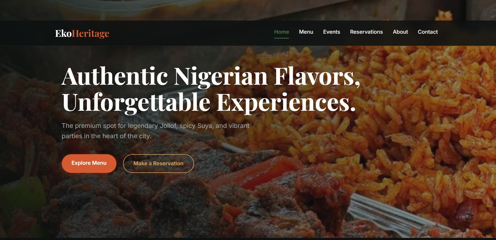

# 🍽️ Eko Heritage Restaurant

A modern and responsive restaurant website built with **HTML, CSS, JavaScript and Firebase**. The website provides an engaging experience for users to explore the restaurant, view the menu, and learn more about its services.

##  Live Demo

https://ekoheritage.netlify.app/

## 📸 Screenshot

---

 Features

- Responsive design
- Beautiful landing page
- Interactive navigation
- Restaurant menu
- Contact section
- Mobile-friendly layout

---

##  Technologies Used

- HTML5
- CSS3
- JavaScript
- Firebase
- Firestore

---

## 🚀 How to Run

1. Clone this repository.
2. Open the project folder.
3. Open `index.html` in your browser.

---

## 👨‍💻 Author

**Isaac Zachariah**

GitHub: https://github.com/isaacbuildsgood
